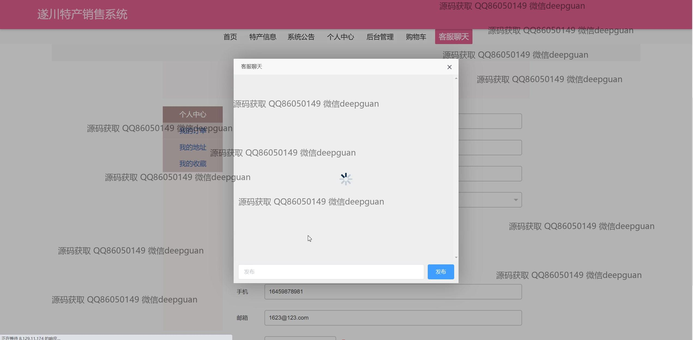
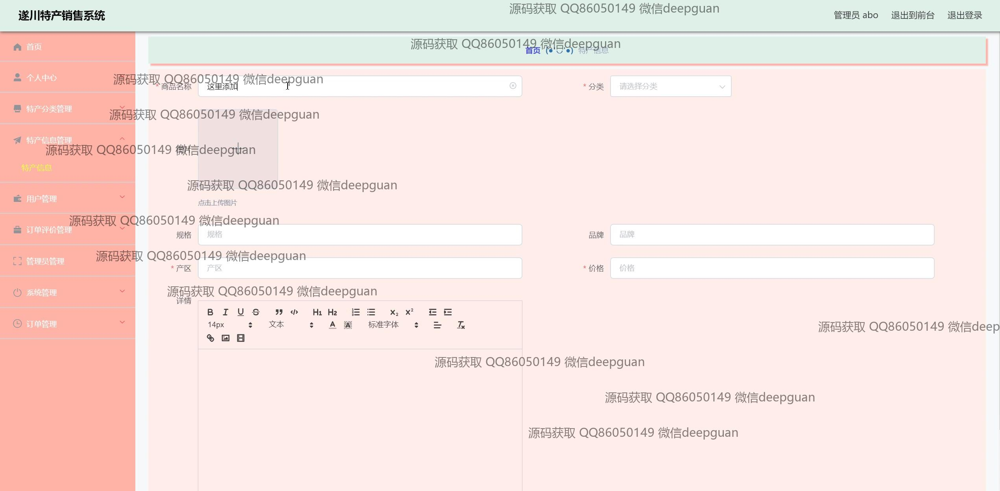
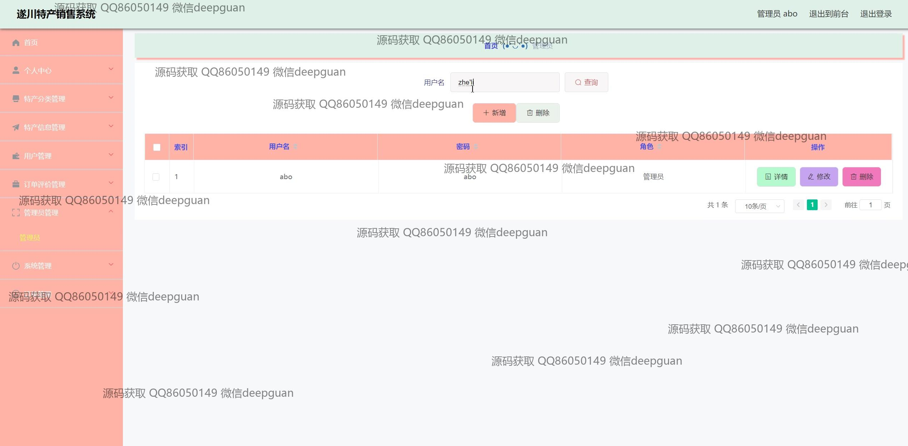

<h1 align="center">遂川特产销售网站vue</h1>

## 简介
遂川特产销售网站：角色分为管理员、用户；提供特产信息管理、订单管理、用户管理、个人中心、购物功能、系统公告和客服聊天等多项功能，用户界面简洁友好，操作方便。    --计算机毕业设计源码；毕设源码；java毕业设计源码

## 联系方式

<h3 align="center">获取完整代码与数据库文件 + 微信：deepguan QQ: 86050149 QQ群: 783742310</h3>

<h3 align="center">可帮忙远程部署 包运行成功！提供远程部署、修改代码、设计文档指导、代码讲解等服务！</h3>

## 功能介绍（完整见运行截图）
管理员：登录界面支持角色选择和凭证验证；导航菜单包含个人中心、特产分类管理、用户管理、订单管理、系统公告和客服聊天等功能模块；商品管理支持添加、修改、删除商品信息，包括图片上传、规格设置和详情编辑；订单管理提供订单查询、发货和状态更新功能；系统管理涵盖轮播图管理、公告发布、管理员账户管理等；用户信息管理功能包括新增、修改和删除用户信息，支持按用户名和姓名搜索。

用户：基本功能包括登录、注册和退出；首页提供商品浏览、公告查看、特产推荐和商品搜索功能；商品详情页展示商品图片、分类、价格、规格等信息，支持商品收藏、加入购物车和在线结算；个人中心支持查看和编辑个人信息、管理订单、收货地址和收藏夹；订单确认页面提供订单核对、地址选择及支付类型选择；客服聊天功能提供即时消息交互。

游客：首页导航栏允许游客浏览特产信息、系统公告和商品列表；商品详情页提供详细展示，但购买和收藏等功能需登录后操作；客服聊天功能支持游客咨询；轮播图和风景展示模块增强用户体验。

客服：客服页面包含聊天功能模块，支持表情符号和拼音输入；可以与用户或游客实时沟通，提供特产推荐、订单处理协助和信息咨询；后台管理支持查看和发布系统公告，协助管理员优化客服体验。

## 运行截图

本代码来源于网络,仅供学习参考使用!

